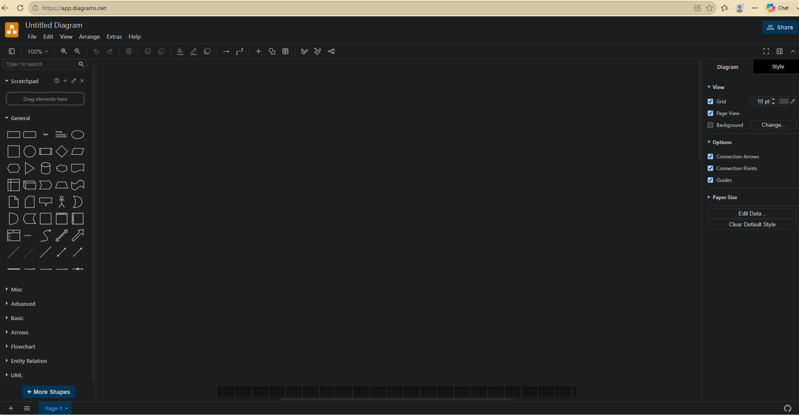
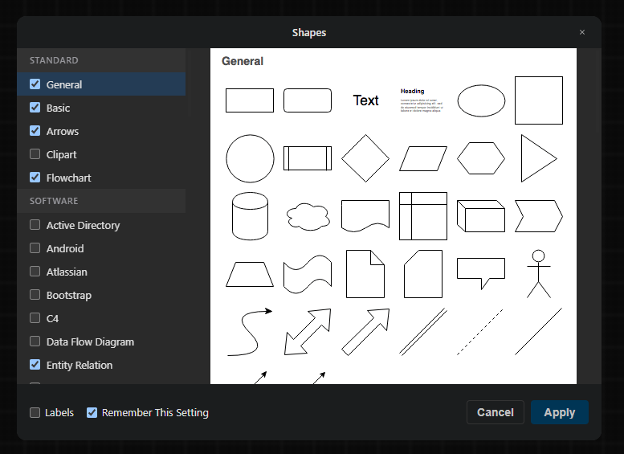
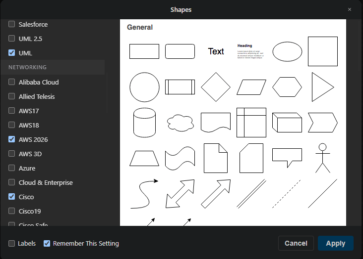
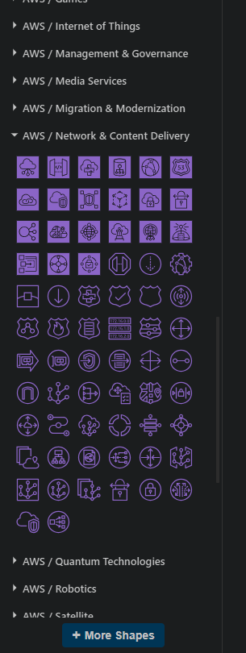
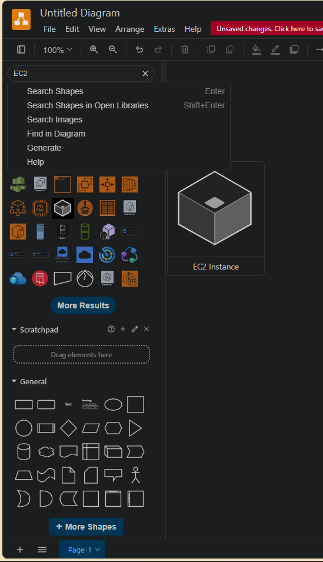
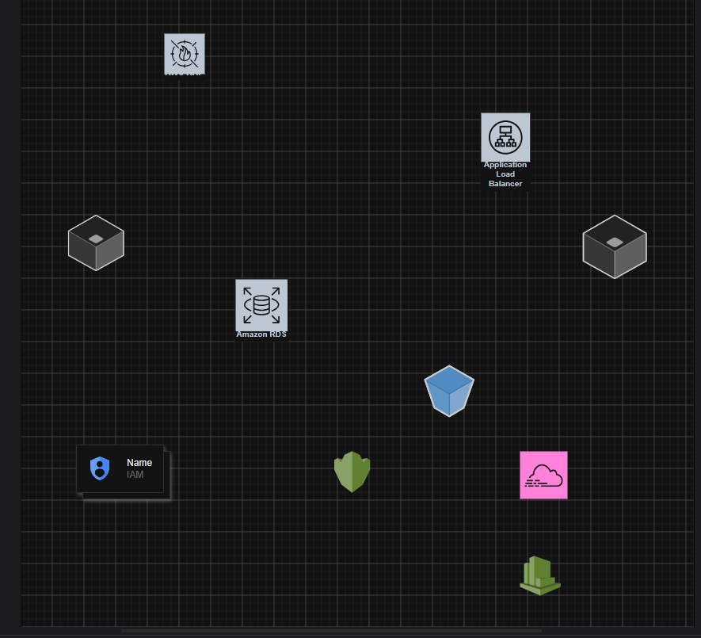
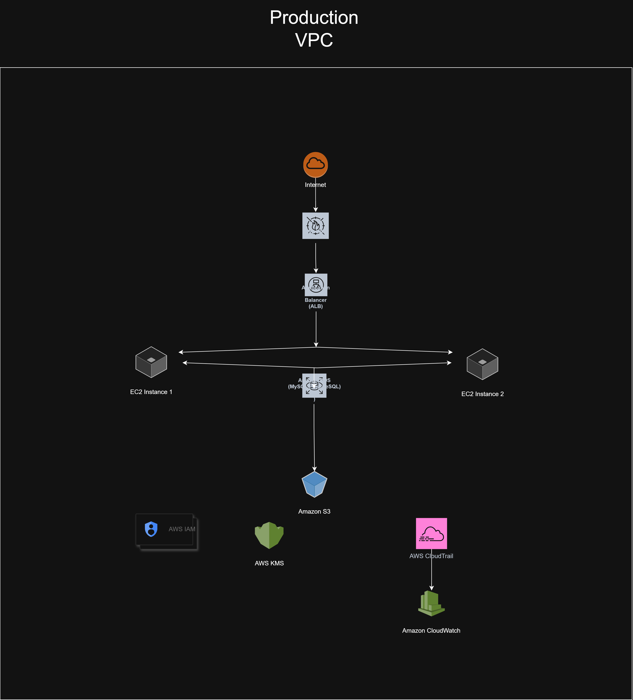

# AWS Cloud Security Architecture

## Project Overview

This project demonstrates the design of a secure AWS cloud architecture using *diagrams.net (draw.io)* and the *AWS Architecture Icons (2026)*.

The objective of this project is to design a secure, scalable, and highly available cloud infrastructure following AWS best practices. The architecture includes security services, monitoring, logging, encryption, storage, networking, and compute resources.

---

# Architecture Diagram

---

# Project Objectives

- Design a secure AWS cloud architecture.
- Demonstrate AWS networking concepts.
- Implement layered security controls.
- Follow AWS Well-Architected design principles.
- Document the complete architecture professionally.
- Build a portfolio-ready cloud security project.

---

# AWS Services Used

- Amazon VPC
- AWS WAF
- Application Load Balancer (ALB)
- Amazon EC2
- Amazon RDS (MySQL)
- Amazon S3
- AWS IAM
- AWS KMS
- AWS CloudTrail
- Amazon CloudWatch

---

# Architecture Flow

1. User traffic enters through the Internet.
2. AWS WAF filters malicious requests.
3. Application Load Balancer distributes traffic.
4. Requests are forwarded to Amazon EC2 instances.
5. EC2 instances communicate with Amazon RDS.
6. Amazon S3 stores application files and backups.
7. AWS IAM manages identity and permissions.
8. AWS KMS encrypts sensitive resources.
9. AWS CloudTrail records AWS API activities.
10. Amazon CloudWatch monitors infrastructure health and logs.

---

# Security Features

- Web Application Firewall (AWS WAF)
- Secure Virtual Private Cloud (VPC)
- Load Balancing
- Identity & Access Management
- Encryption using AWS KMS
- Continuous Monitoring
- Activity Logging
- High Availability Design
- Secure Data Storage

---

# Tools Used

- diagrams.net (draw.io)
- AWS Architecture Icons (2026)

---

# Repository Structure

aws-cloud-security-architecture/
│
├── aws-cloud-security-architecture.drawio
├── README.md
│
└── evidence/
    ├── 01_Diagrams.net_Dashboard.png
    ├── 02_More_Shapes_Menu.png
    ├── 03_AWS2026_Shapes_Selection.png
    ├── 04_AWS2026_Shape_Libraries_Loaded.png
    ├── 05_AWS_Network_Content_Delivery_Icons.png
    ├── 06_EC2_Search_Results.png
    ├── 07_AWS_Components_Placed_On_Canvas.png
    └── 08_AWS_Cloud_Security_Architecture_Diagram.png

---

# Evidence

## Step 1 – diagrams.net Dashboard

---

## Step 2 – More Shapes Menu

---

## Step 3 – AWS 2026 Shapes Selection

---

## Step 4 – AWS Shape Libraries Loaded

---

## Step 5 – AWS Network & Content Delivery Icons

---

## Step 6 – EC2 Search Results

---

## Step 7 – AWS Components Placed on Canvas

---

## Step 8 – Final AWS Cloud Security Architecture

---

# Skills Demonstrated

- AWS Cloud Architecture
- AWS Networking
- AWS Security Services
- Infrastructure Documentation
- Cloud Security Design
- Technical Diagramming
- Security Best Practices
- AWS Service Integration

---

# Learning Outcomes

- Understood AWS architecture design.
- Learned AWS networking components.
- Practiced secure cloud infrastructure design.
- Improved cloud documentation skills.
- Created a portfolio-ready cloud security project.

---

# Future Improvements

- Multi-AZ Deployment
- Auto Scaling Group
- NAT Gateway
- Private Subnets
- AWS Shield
- AWS Secrets Manager
- Amazon Route 53
- AWS Backup
- Amazon EFS
- CI/CD Integration

---

# Author

*Chandranil Sawant*

Cybersecurity | Cloud Security | AWS | Ethical Hacher | SOC Analyst | Threat Detection

GitHub:
https://github.com/chandranil-sawant-tech
